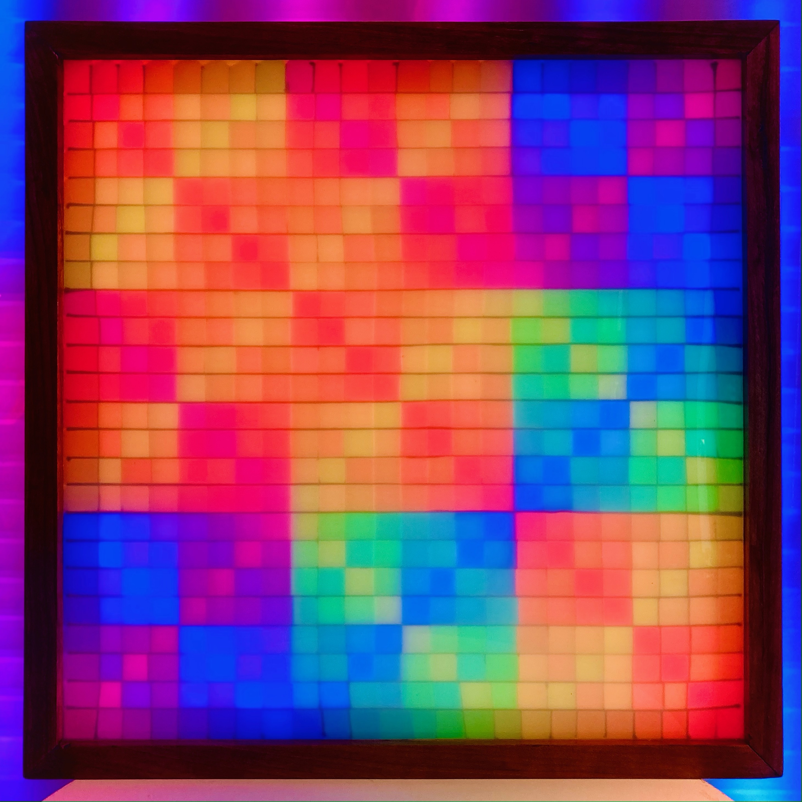

# Matrix display

A 24x24 display made of a serpentine layout of DotStar (APA102) programmable RGB LEDs



## microcontroller

itsy bitsy 5v 32u4 16mhz

https://www.adafruit.com/product/3677

To upload sketch in Arduino IDE:

- use usb 2 hub
- Need to press reset button twice rapidly after initiating sketch upload

## gifs
convert gif and place into paste buffer:
```
python tools/image_to_bytes.py assets/amiga-logo.gif amiga | pbcop
```
Then paste into `gifs.h`


gifs from https://www.pouet.net/userlist.php?page=12

